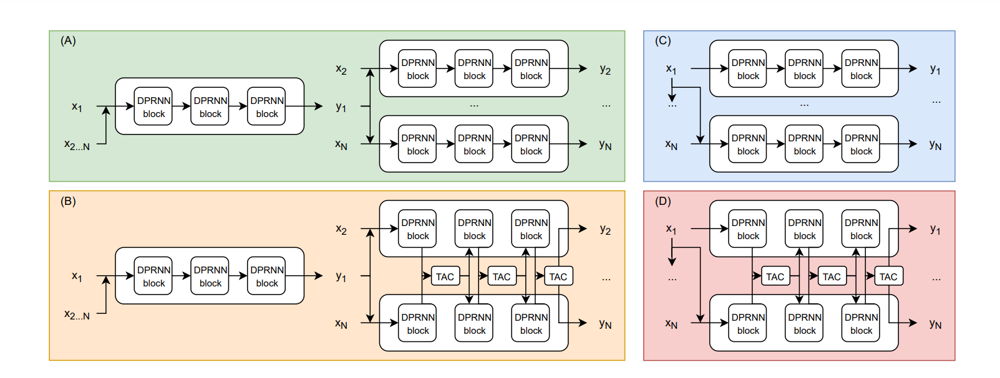

# Transform-average-concatenate (TAC) 

- Number invariant multi-channel speech separation
- Based on filter-and-sum network

## TAC
> It first transforms each channel's feature with a sub-module shared by all channels, and then the outputs are averaged as a global pooling stage and passed to another sub-module for extra nonlinearity. The corresponding output is then
concatenated with each of the outputs of the first transformation submodule and passed to a third sub-module for generating channeldependent outputs. It is easy to see that, with parameter sharing at
the transform and concatenate stages and the permutation-invariant
property of the average stage, TAC guarantees channel permutation
and number invariant processing and is always able to make global
decisions. 

## Architecture

## Dataset
- Used 20000, 5000 and 3000 4-second long utterances from the Librispeech dataset (a multi-channel noisy reverberant)

# References:
https://arxiv.org/pdf/1910.14104.pdf
https://github.com/yluo42/TAC

